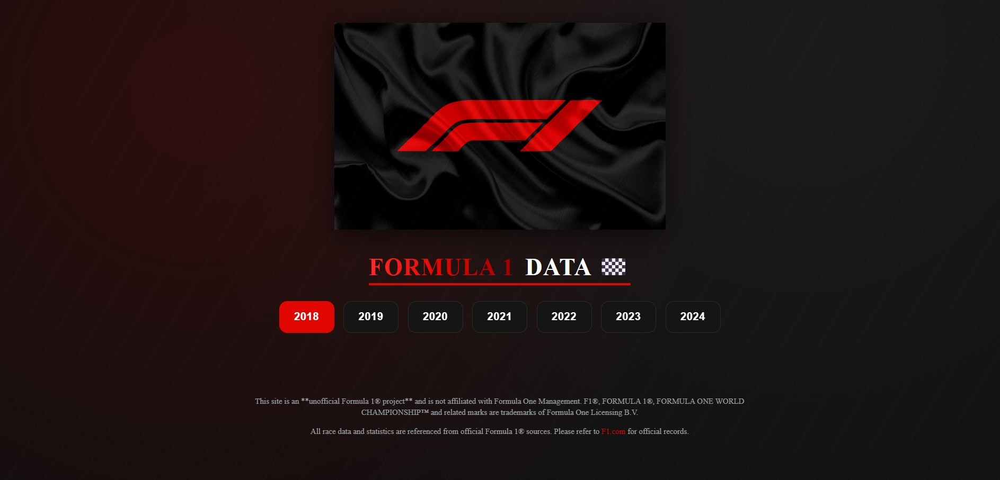
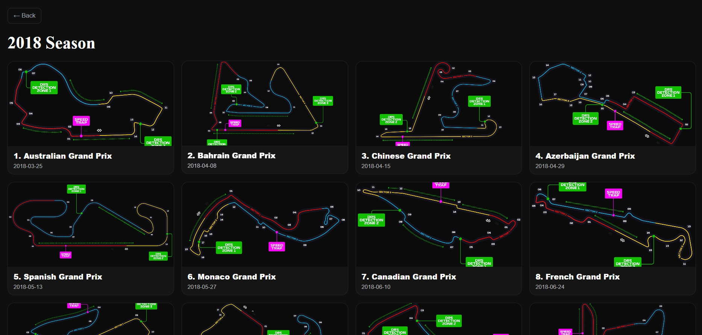
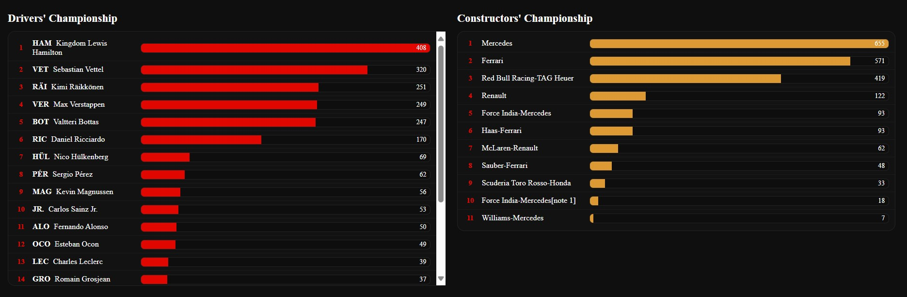
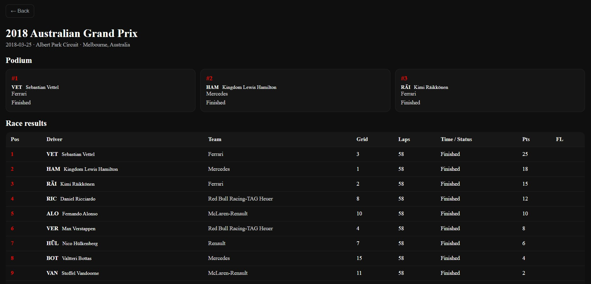

# f1-data-web
Full-stack Formula 1 data visualization site built with React, Node.js, and MongoDB — includes interactive tables &amp; charts, starting from 2018 season and expanding through 2024.

## Screenshots

### Home Page

### Race Data Table

